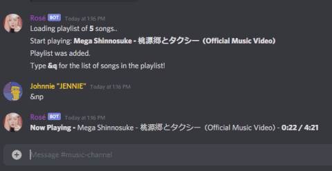
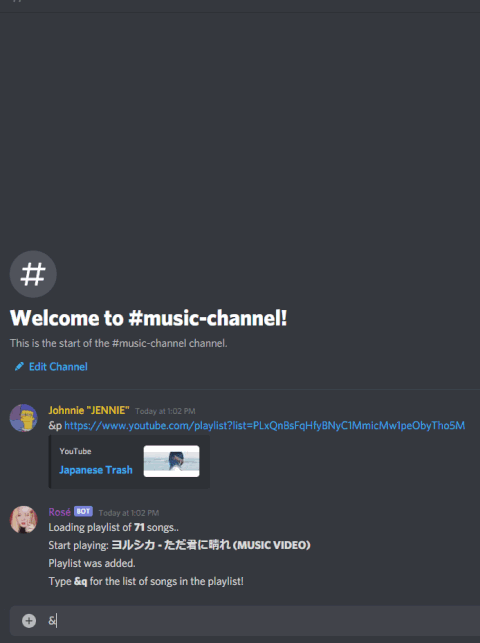
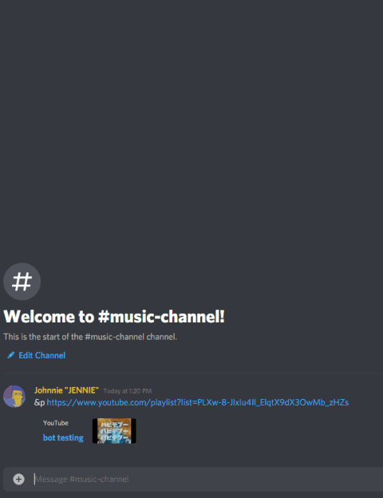

# Rosé Music Bot

A Discord bot that streams audio to voice channels and features many other useful commands and utilities.

A lightweight aggregator, currently deployed and hosted on Heroku. Even when hosted locally, Rosé is low-impact on system resources and still features quick response times. 

For any questions, concerns, or assistance in getting this bot into your server - contact:

(e-mail) johnnie.tan27@gmail.com

(Discord) j o n#4444


## Table of Contents

* [Features](#features)
* [Requirements](#requirements)
* [Getting started](#getting-started)
* [Navigating the API](#navigating-the-api)
* [Author](#author)

## Features

- Play music
- Skip songs
  - 
- Pause and Resume playback
- Seeking and Looping
- Dynamic playlists 
  - 
  - 
- YouTube queryable searches
  - 
- Lyrics by Genius-API
- Search up song, album, artist information using Spotify-API
- Scrobble audio, get listening trends, and history using LastFM-API
- (NEW!) Search up public instagram accounts and hash tags
  -  write-access methods for logged in Instagram accounts

- Weekly/Daily server reminders

## Requirements

- [Node](https://nodejs.org/en/)
- [NPM](https://www.npmjs.com/)
- [Mongoose-ODM](https://www.npmjs.com/package/mongoose)

- [FFMPEG](https://www.ffmpeg.org/)
- [ytdl-core](https://www.npmjs.com/package/ytdl-core)
- [ytsr](https://www.npmjs.com/package/ytsr)
- [Simple-Youtube-API](https://www.npmjs.com/package/simple-youtube-api)

### Optional
- [Spotify-API](https://developer.spotify.com/documentation/web-api/)
- [LastFM-API](https://www.last.fm/api)
- [Genius-API](https://docs.genius.com/)
- [Google-translate-web-API]
- [Instagram-API](https://developers.facebook.com/docs/instagram-basic-display-api)
- [Cron](https://www.npmjs.com/package/cron) 

## Getting Started

First, make sure you have all the required modules and dependencies then continue with the following steps!

### Installation

```bash
# Clone the respository
git clone https://github.com/jcheonsa/rose-music-bot

# Enter into the directory
cd rose-music-bot/

# Install the dependencies
See the requirements above!
```
1) open 'config.json' in Rosé's root directory
2) configure your desired command prefix, place all of your API keys and Rosé/guild/channel IDs in the corresponding areas

### Configuration
After cloning the project and installing all of the dependencies, you're going to need to add your Discord API token in the config.json file as well.

https://discord.com/developers/applications to create your own Rosé clone and get your token!


## Navigating the API
NOTE: Most, if not all of the information being read from the different APIs are presented to users using Discord's embed UI. In other words, they're kind of limited by their API. Reaction buttons and typing are used to directly interact with Rosé and the interfaces.

At the moment `version 4` of Rosé handles lastFM, Spotify, YouTube, Google Translate, Genius, and Instagram APIs (the list will continue to grow!) for basic information visualization and querying.

This example show how to authenticate with the Spotify API.
Authentication is only required to make signed method calls or use write methods.

```js
// ** BEGIN EDIT HERE **************************************************

var API_KEY = ''; // YOUR  API KEY HERE
var API_SECRET = ''; // YOUR API SECRET HERE
var DEMO_PORT = 1337;
var DEMO_URL = 'http://localhost:' + DEMO_PORT;

// ** END EDIT HERE ****************************************************

if ( !API_KEY || !API_SECRET ) {
	console.log('Please edit `API_KEY` and `API_SECRET` before running this example.');
	console.log('If you don\'t have an API key, get one here: http://www.last.fm/api/account/create');
	process.exit(1);
}

const spotifyAPI = new SpotifyWebAPI({
  clientID: API_KEY,
  clientSecret: API_SECRET,
  REDIRECT_URL: DEMO_URL + DEMO_PORT + `/callback`
})

// define the methods (documentation available at https://developer.spotify.com/documentation/web-api/)
const scopes = [];

// attempt to connect to Spotify with the previously defined signed access methods
app.get('/login', (req, res) => {
    res.redirect(spotifyApi.createAuthorizeURL(scopes));
});

app.get('/callback', (req, res) => {
  const error = req.query.error;
  const code = req.query.code;
  const state = req.query.state;

  if (error) {
    console.error('Callback Error:', error);
    res.send(`Callback Error: ${error}`);
    return;
  }

  // generate authorization token for all queries to/from Rosé
  spotifyApi
    .authorizationCodeGrant(code)
    .then(data => {
      const access_token = data.body['access_token'];
      const refresh_token = data.body['refresh_token'];
      const expires_in = data.body['expires_in'];

      spotifyApi.setAccessToken(access_token);
      spotifyApi.setRefreshToken(refresh_token);

      // make access_token callable for all methods
      module.exports = access_token;

      // refresh the token at a set interval
      setInterval(async () => {
        const data = await spotifyApi.refreshAccessToken();
        const access_token = data.body['access_token'];
        spotifyApi.setAccessToken(access_token);
      }, expires_in / 2 * 1000);
    })
});
```
This authentication example is interchangeable for all lastFM, Spotify, and Instagram APIs. After authentication, the token will remain valid for 1 hour, after which it would need to be refreshed. Currently Rosé does not have a method for automatically refreshing this token. (WIP)

### Spotify (WIP)
All Spotify API methods require authentication. Rosé is currently written with an automatically refreshing access token and cookie script when running her read-access methods (writing is a wip).

```js
// Look up artists, albums, songs on Spotify
`${prefix}sysearch`
```

### lastFM
The lastFM API key allows read-access to basic information available on the lastFM site. You'll need to bind the bot to an account for writing and scrobbling.

```js 
// Bind a lastFM account to user for read-access to lastFM account information
`${prefix}lfmreg`

// After binding the bot to a lastFM account, users can begin querying for playback history and trends.
`${prefix}lfmhistory` 
```
Song name, duration, and artists are auto-corrected when scrobbling! 

### Instagram (WIP)
Rosé currently uses Instagram's [Basic Display API](https://developers.facebook.com/docs/instagram-basic-display-api), where most read-access methods do not require authentication.

```js
// If you want to write, then you can either login to an account:
const Instagram = require('instagram-web-api')
var insta_user = ``;
var insta_pw = ``;
// or use the above access token script
```
Please note that I highly discourage using the bot in this way, as this gives all users on the server (yes, ALL of them) read/write access on the logged account. You can edit the permissions in Rosé's command-handler to get around this.

### Google Translate

## To Do

- [ ] adding instructional gifs
- [x] fix seeking
- [x] reconstruct main playbick, searching, and queueing scripts for improved accessibility
- [ ] write-access to spotify
- [ ] write-access to instagram
- [x] write-access to lastFM
- [ ] fix translation api
- [ ] modular dependencies
- [x] Kaiba-bot

## Author

Johnnie Tan